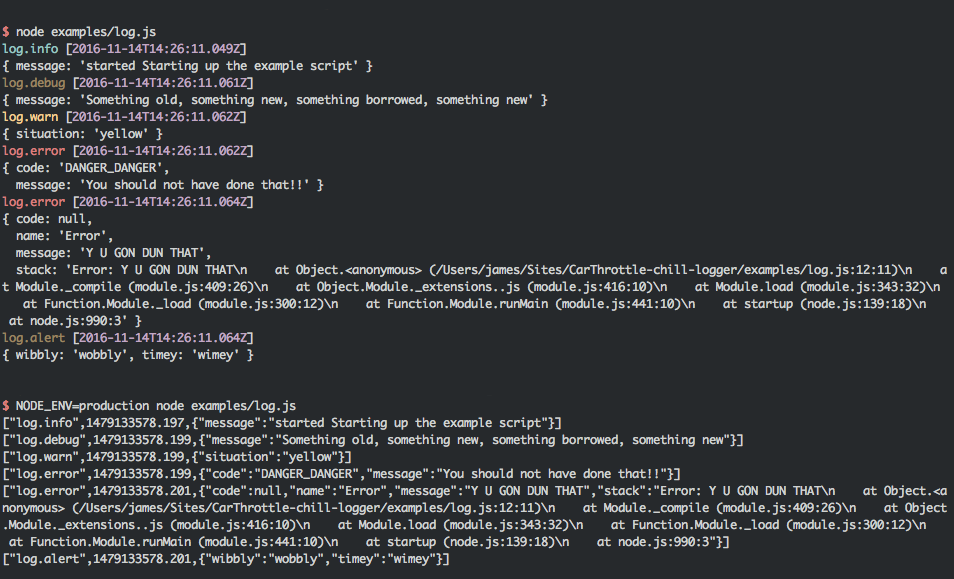
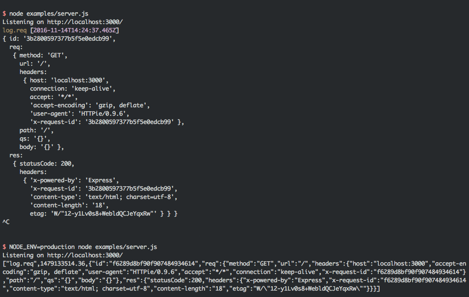

# Chill Logger

> Relax dude, your logs are covered

Working with Docker & ECS presents some interesting challenges & some interesting features, including application logs
[through Docker & Fluentd](https://docs.docker.com/engine/admin/logging/fluentd/). However this requires a specific
format to be printed out to *stdout*, so this module prints logs in a specific format for Fluentd to consume.





In development, your logs are formatted slightly to add [color](https://www.npmjs.com/package/colors) (optionally) and
to add clearer spacing. In production they are minified (well, just not padded out) and line-by-line they will be sent
to Fluentd courtesy of the Docker logging driver.

## Installation

```
$ npm install --save chill-logger
```

If you would like colors when looking at logs during development, also include *colors* too:

```
$ npm install --save-dev colors
```

Without *colors*, your logs will be formatted into the same layout but there won't be any colors :cry:

## Usage

The easiest way to use this is to define a file for your logger:

```js
var logger = require('chill-logger')({
  name: 'my-awesome-project',
  level: process.env.LOG_LEVEL || 'debug' // Allows you to override it at runtime
});
```

More "advanced" usage could look like:

```js
// In logger.js
var logger = require('chill-logger');

module.exports = logger({
  name: 'my-awesome-project',
  level: process.env.LOG_LEVEL || 'debug' // Allows you to override it at runtime
});

module.exports.alert = function () {
  module.exports._send('alert', arguments);
};

// In another file
var logger = require('./logger')
logger.alert('Something needs someones attention!');
```

## API

```js
var log = require('chill-logger')();
// By default, the name for the logger is "log"
// And by default the log level is "debug", to allow everything through

log.debug('This is a debug statement');
// This will write the log line as "log.debug"

log.info('This is a simple INFO statement');
// This will write the log line as "log.info"

log.warn('This is a WARNING statement');
// This will write the log line as "log.warn"

log.error('This is an ERROR statement');
// This will write the log line as "log.error"

log.info({ state: {}, contents: [] });
// This will write the object as "log.info"

// You can optionally create types on demand:
log.info('location', { name: 'London' });
// This will write the object as "log.location"

// Or you can create functions to create new types, by passing arguments to the _send method:
log.alert = function () {
  log._send('alert', arguments);
};
// And then use it straight away!
log.alert('This is an ALERT statement');
```

### Errors

This logger will format errors into plain objects by passing them through the `formatErr` function that's provided.
You can override this method if you want to include additional properties:

```js
var logger = require('chill-logger');
var os = require('os');

module.exports = logger({
  name: 'my-awesome-project',
  level: process.env.LOG_LEVEL || 'debug' // Allows you to override it at runtime
});

logger.formatErr = function (err) {
  return {
    code: err.code || null,
    name: err.name,
    message: err.message,
    instance_id: os.hostname(),
    query: err.query || null,
    stack: err.stack
  };
};
```

### Middleware

**chill-logger** offers a way to create a HTTP request logger middleware function using your logger to output
the request.


```js
var chill = require('chill-logger');
var express = require('express');

var app = express();
var logger = chill();

app.use(chill.middleware(logger));

app.get('/', function (req, res) {
  res.send('Welcome to my app!');
});
```

Requests get logged into `.req` at the `info` level (so if you set the log-level to `warn` or above then you won't see
any requests being logged - useful for integration tests!) and the request & response are transformed into plain objects
describing the many properties of a request.

```json
{
  "id": "${Generated-ID-associated-with-this-request}",
  "req": {
    "method": "GET",
    "url": "/",
    "headers": {
      "user-agent": "HTTPie/0.9.6",
      "x-request-id": "${Generated-ID-associated-with-this-request}"
    },
    "path": "/",
    "qs": "{}",
    "body": "{}"
  },
  "res": {
    "statusCode": 200,
    "headers": {
      "x-powered-by": "Express",
      "x-request-id": "${Generated-ID-associated-with-this-request}"
    }
  }
}
```

There are a few options to let you customise the logger, so you can get/set/override various properties:

```js
chill.middleware(logger, {
  generateHeaderId: uuid.v4, // A function that returns a unique ID (defaults to crypto.randomBytes(12))
  header: 'X-Awesome-Req-ID', // A function to set the name of the header
  req: function (req) {}, // Build your own req object for this request, useful to omit headers etc.
  res: function (res) {}, // Build your own res object for this request, useful to omit headers etc.
  format: function (log, req, res) {}, // Edit the logged request one more time once the response has been sent
})
```

Usually, if you want to add information to the log after the request has completed, and logins/sessions/events have
occurred, then you'd want to use `format` over `req` or `res`:

```js
chill.middleware(logger, {
  format: function (log, req, res) {
    // "log" is an plain object about to be logged, with req and res properties for you to modify as you please
    // "req" and "res" are as expected: the req and res associated with this request
    if (req.user && req.user.id) {
      log.req.user = { id: req.user.id };
    }
  },
})
```

Please note: `req` executes as the request hits this middleware, whereas `res` and `format` execute after the response
has been sent by the HTTP server. Choose your logic wisely!

## One more thing...

Feel free to [open an issue](https://github.com/car-throttle/chill-logger/issues), and this is an open-source project
so pull-requests are welcome!
